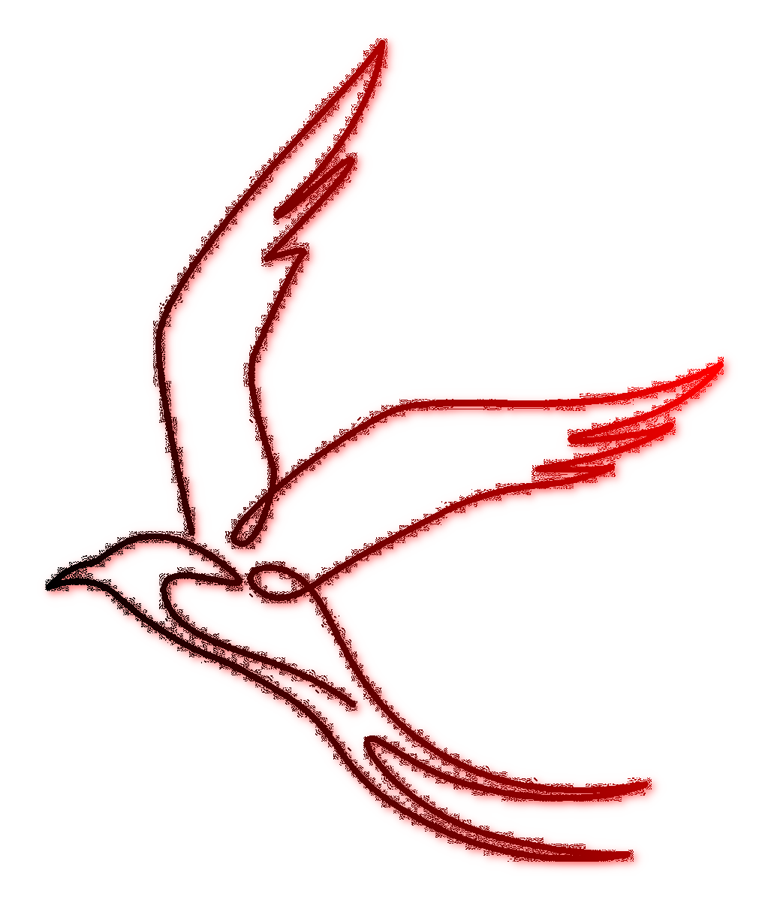

<div align="center">



# Swallow

*A minimalist functional programming language*


[](https://github.com/X-FRI/swallow/actions/workflows/build.yaml)

</div>

- Copyright (c) 2023 Muqiu Han
- This project is built using xmake: https://xmake.io/
- FAQ: https://github.com/muqiuhan/Swallow/blob/main/FAQ
- Issues: https://github.com/muqiuhan/Swallow/issues
- Contribution: https://github.com/muqiuhan/Swallow/pulls

---

## Build & Install

To build and run with [xmake](xmake.io):
> Setup: Install the [xmake](xmake.io), [flex]() and [bison]()
  
- To build:   xmake build
- To run:     xmake run
- To install: xmake install

## Introduction

### Typechecking
```rescript
data Bool = [ True, False ]
data List = [ Nil, Cons Int List ]

let main(argv) = {
    match argv with {
    | True => { 0 }
    | Nil => { 1 }
    }
}
```

```
[E013] Error: Type checking failed for pattern
    /-[example/PatternType.sw]
    o
  6 |      | True => { 0 }
  7 |      | Nil => { 1 }
    o        ^^^^        
    o        := This pattern has type 'List', but here may need a 'Bool'
  8 |      }
    o
    o-- Note: 'Bool' conflicts with 'List'
----/
```

### Pattern Matching
```rescript
data List = [ Nil, Cons Int List ]

let main(argv) = {
  match argv with {
  | Nil => { 0 }
  | Cons x xs => { 0 }
  }
}
```

### Garbage Collection
...

### Polymorphism
...

## Acknowledge

### Tools
- [XMake: A cross-platform build utility based on Lua](https://xmake.io/#/)
- [GNU Bison: A general-purpose parser generator](https://github.com/akimd/bison)
- [Flex:  The Fast Lexical Analyzer - scanner generator for lexing in C and C++](https://github.com/westes/flex)


### Library/Frameworks
- [optional: C++11/14/17 std::optional with functional-style extensions and reference support](https://github.com/TartanLlama/optional)
- [result: Result<T, E> for Modern C++](https://github.com/p-ranav/result)

## REFERENCE
- [Theory of computation](https://en.wikipedia.org/wiki/Theory_of_computation)
- [Functional programming](https://en.wikipedia.org/wiki/Functional_programming)
- [Finite-state machine](https://en.wikipedia.org/wiki/Finite-state_machine)
- [Implementing Fun tional Languages: a tutorial](https://www.microsoft.com/en-us/research/wp-content/uploads/1992/01/student.pdf)
- [The G-machine: A fast, graph-reduction evaluator](https://link.springer.com/chapter/10.1007/3-540-15975-4_50)
- [Panic better using modern C++](https://buildingblock.ai/Panic)
- [Hindley–Milner type system](https://en.wikipedia.org/wiki/Hindley%E2%80%93Milner_type_system)
- [Unification](https://en.wikipedia.org/wiki/Unification_(computer_science))
- [Compiling a Functional Language Using C++](https://danilafe.com/blog/00_compiler_intro/)

## [LICENSE](./LICENSE)
```
Copyright (c) 2023 Muqiu Han

All rights reserved.

Redistribution and use in source and binary forms, with or without modification,
are permitted provided that the following conditions are met:

    * Redistributions of source code must retain the above copyright notice,
      this list of conditions and the following disclaimer.
    * Redistributions in binary form must reproduce the above copyright notice,
      this list of conditions and the following disclaimer in the documentation
      and/or other materials provided with the distribution.
    * Neither the name of Swallow nor the names of its contributors
      may be used to endorse or promote products derived from this software
      without specific prior written permission.

THIS SOFTWARE IS PROVIDED BY THE COPYRIGHT HOLDERS AND CONTRIBUTORS
"AS IS" AND ANY EXPRESS OR IMPLIED WARRANTIES, INCLUDING, BUT NOT
LIMITED TO, THE IMPLIED WARRANTIES OF MERCHANTABILITY AND FITNESS FOR
A PARTICULAR PURPOSE ARE DISCLAIMED. IN NO EVENT SHALL THE COPYRIGHT OWNER OR
CONTRIBUTORS BE LIABLE FOR ANY DIRECT, INDIRECT, INCIDENTAL, SPECIAL,
EXEMPLARY, OR CONSEQUENTIAL DAMAGES (INCLUDING, BUT NOT LIMITED TO,
PROCUREMENT OF SUBSTITUTE GOODS OR SERVICES; LOSS OF USE, DATA, OR
PROFITS; OR BUSINESS INTERRUPTION) HOWEVER CAUSED AND ON ANY THEORY OF
LIABILITY, WHETHER IN CONTRACT, STRICT LIABILITY, OR TORT (INCLUDING
NEGLIGENCE OR OTHERWISE) ARISING IN ANY WAY OUT OF THE USE OF THIS
SOFTWARE, EVEN IF ADVISED OF THE POSSIBILITY OF SUCH DAMAGE.
```
